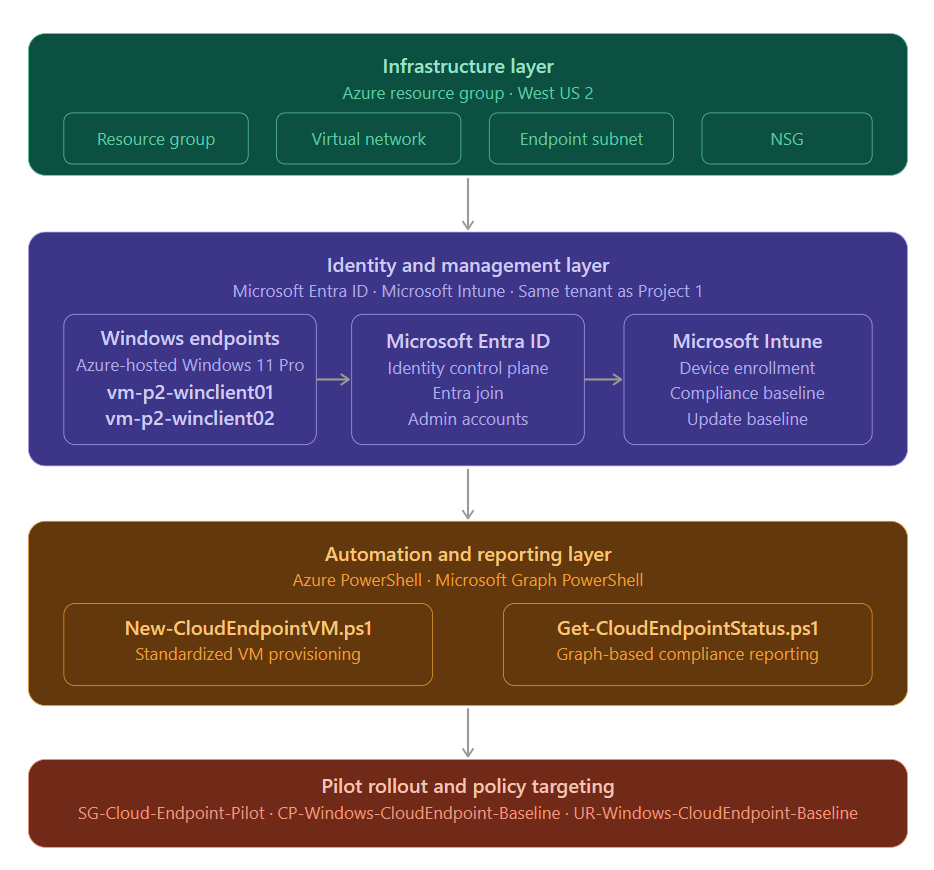
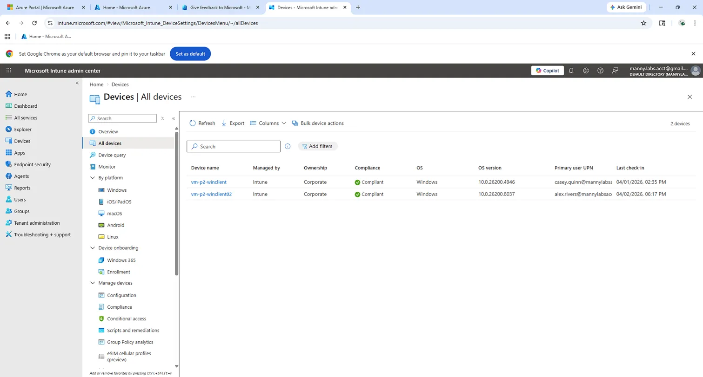

# Azure Cloud Endpoint Management and Compliance

### Extending a cloud-first identity foundation into standardized, policy-driven Windows endpoint management using Microsoft Azure, Microsoft Entra ID, and Microsoft Intune.

> This project is the second in a three-part portfolio series focused on identity, endpoint management, and security operations in a Microsoft cloud environment.

---

## Overview

This project demonstrates a production-minded approach to cloud endpoint management — deploying, enrolling, governing, and reporting on Azure-hosted Windows endpoints using Microsoft Entra ID, Microsoft Intune, and PowerShell automation.

The work is structured in three phases: a pre-production validation phase that surfaced real dependencies before any standard was written, a production implementation phase that turned those findings into a documented and repeatable deployment workflow, and an automation layer that supports both provisioning and operational reporting through Microsoft Graph.

The goal was not to build a lab. The goal was to design something a real organization could actually use.

---

## Key Outcomes

- Deployed two Azure-hosted Windows endpoints using a standardized provisioning workflow with auto-increment naming logic
- Joined endpoints to Microsoft Entra ID and enrolled them in Microsoft Intune through a validated onboarding process
- Created and validated a baseline compliance policy and Windows update ring assigned through a controlled pilot group
- Developed PowerShell automation for endpoint provisioning and Microsoft Graph-based reporting for managed device status
- Validated the endpoint handoff model from admin deployment account to standard user primary ownership
- Documented pre-production findings that directly informed the production standard, including licensing dependencies, MDM scope configuration, and Graph authentication behavior

---

## Business Scenario

The same 75-user organization from Project 1 has completed its identity and access baseline and is now ready to extend that foundation into endpoint governance. The company wants to move away from ad hoc device management and toward a standardized process where every Windows endpoint is deployed consistently, joined to the company identity platform, enrolled in device management, and evaluated against a defined compliance baseline before being handed off to its intended user.

The company also wants to reduce manual effort in the provisioning process and build operational visibility into the compliance and management state of its endpoint fleet through scripted reporting rather than relying entirely on portal-based administration.

---

## Project Architecture



*Four-layer architecture showing Azure infrastructure, Microsoft Entra ID and Intune management, PowerShell automation, and pilot-based policy targeting.*

The environment is built around three connected layers.

The infrastructure layer consists of an Azure resource group, virtual network, subnet, and network security group that together provide a controlled and cost-conscious foundation for cloud-hosted Windows endpoints.

The identity and management layer connects each endpoint to Microsoft Entra ID through Microsoft Entra join and enrolls it into Microsoft Intune for policy-based governance. The same Entra tenant used in Project 1 serves as the identity control plane for both projects.

The automation and reporting layer uses Azure PowerShell to standardize endpoint provisioning and Microsoft Graph PowerShell to validate and report on device management state across the environment.

---

## Phase 0 — Pre-Production Validation

Before defining any production standards, a dedicated validation phase was completed to test whether the environment could support the intended cloud endpoint management workflow from end to end.

This phase was intentionally exploratory. The goal was to identify dependencies, validate enrollment behavior, and discover what the environment actually required before any production process was documented.

During this phase, a Windows 11 Azure virtual machine was deployed, joined to Microsoft Entra ID, and brought through the Intune enrollment process. Several important dependencies were uncovered that directly shaped the production design.

Microsoft 365 Business Premium licensing had to be assigned to the deployment account before Intune enrollment would behave as expected. The Intune MDM scope had to be explicitly configured in the tenant before devices could automatically enroll. The Entra join process required an internal tenant account rather than a personal Microsoft account or external identity. Administrative access to the virtual machine was affected by NSG rules that only accounted for one network location, which caused disruption when administration moved to a different environment.

Each of these findings was documented and carried forward into the production standard. The pre-production phase is the reason the production workflow is reliable rather than improvised.

---

## Production Implementation

With the validation phase complete, the production implementation focused on turning those findings into a documented, repeatable standard.

### Network and Infrastructure

The production environment uses a dedicated Azure resource group, virtual network with an endpoint subnet, and a network security group that controls inbound access. Remote desktop access is restricted to the current approved administrator public IP address rather than being left broadly open, reflecting the principle of minimal exposure carried forward from Project 1.

Virtual machines are sized to fit within tested regional availability constraints and are configured with auto-shutdown to support cost discipline throughout the project lifecycle.

### Identity and Enrollment

Each endpoint is joined to Microsoft Entra ID using an approved internal tenant administrator account. Intune enrollment follows the join either automatically through the configured MDM scope or through the manual enrollment path when needed. Both paths were validated during the project.

### Pilot Scope and Policy Assignment

Rather than assigning production policies broadly, a dedicated pilot assignment group was created to support controlled rollout.

**Group Name:** SG-Cloud-Endpoint-Pilot

All production baseline policies are assigned through this group, which allows the organization to validate policy behavior on a controlled set of devices before expanding the scope.

### Compliance Baseline

The first production compliance policy was created with the intent of establishing a stable, supportable baseline rather than an aggressive hardening standard.

**Policy Name:** CP-Windows-CloudEndpoint-Baseline

The policy enforces firewall enabled, antivirus enabled, antispyware enabled, Microsoft Defender Antimalware protection active, real-time protection enabled, and security intelligence up to date. Settings such as BitLocker, Secure Boot, and TPM requirements were intentionally left out of the first baseline to allow the organization to validate a clean starting point before adding more demanding controls.

**This baseline was intentionally designed as a supportable starting point rather than a fully hardened final-state policy.**

### Update Baseline

A Windows update ring was created to define the organization's first production update management standard.

**Policy Name:** UR-Windows-CloudEndpoint-Baseline

The policy uses the General Availability servicing channel, allows Microsoft product and driver updates, and configures updates to install and restart during maintenance hours. The deferral period was set to zero days for the initial baseline, reflecting the organization's current maturity level with endpoint management.

### Endpoint Handoff Model

Initial deployment and configuration are performed under an approved internal administrator account. Once the endpoint has been joined, enrolled, and validated against the compliance baseline, it is associated with its intended standard user as the primary user in Intune. Administrative access remains separate for ongoing support and management. This model reflects the same identity separation principle established in Project 1.

---

## Repeatable Production Workflow

The production validation process established a clear, repeatable workflow for deploying future endpoints. The full workflow is documented in the docs folder. At a high level, the approved process is as follows.

The provisioning script is run to create the endpoint using the company naming standard, with auto-increment logic ensuring each new device receives the next available number in the sequence. The NSG is confirmed to allow RDP access from the current administrator network location. The endpoint is validated for basic connectivity and OS readiness. Defender signatures are updated before enrollment to ensure the device passes the security intelligence compliance check on first evaluation. The device is joined to Microsoft Entra ID using the approved internal administrator account. Intune enrollment is confirmed either through automatic enrollment or the manual path. The device is added to the pilot assignment scope so it receives the production baseline policies. A sync is forced and compliance is validated. The primary user is updated from the administrator account to the intended standard user. The device is recorded as production-ready.

---

## Automation

Two PowerShell scripts support the production workflow and are available in the scripts folder.

### New-CloudEndpointVM.ps1

This script standardizes the Azure side of endpoint provisioning in support of the company deployment workflow. It validates that the required network infrastructure exists before creating any resources, detects existing virtual machines that follow the company naming convention, automatically selects the next available endpoint number to maintain naming consistency, and creates the public IP address, network interface, and virtual machine using the approved configuration. It also configures auto-shutdown for cost control and outputs a deployment summary along with the next steps in the onboarding workflow.

The script standardizes naming convention enforcement, network placement, image selection, cost controls, and deployment output so that each endpoint provisioning run produces a consistent and documented result. The script uses a shortened Windows computer name during deployment to comply with the 15-character Windows hostname limit while preserving the full naming convention in the Azure resource layer.

### Get-CloudEndpointStatus.ps1

This script connects to Microsoft Graph and queries Intune for managed device data in support of operational validation and compliance reporting. It returns device name, primary user, ownership type, management state, compliance state, operating system, OS version, last sync time, and Azure AD device ID for any device matching the company endpoint naming prefix.

The script supports operational validation after deployment, compliance reporting for the managed endpoint fleet, and device inventory visibility without requiring portal access. Results can be displayed in the console or exported to CSV.

---

## Validation and Evidence

The following evidence demonstrates successful provisioning, enrollment, compliance evaluation, and Graph-based reporting across both pilot endpoints.



| Evidence | Description |
|---|---|
| [Provisioning Script Output](./evidence/provisioning-script-output.png) | Auto-increment naming logic detects vm-p2-winclient01 and provisions vm-p2-winclient02 using the approved company standard |
| [Compliance Policy Detail](./evidence/vm02-compliance-both-policies-compliant.png) | All six CP-Windows-CloudEndpoint-Baseline settings passing on vm-p2-winclient02 |
| [Graph Reporting Output](./evidence/graph-reporting-final-output.png) | Both devices confirmed as company-owned and managed via Microsoft Graph API with standard users as primary owners |
| [MDM Scope Configuration](./evidence/intune-mdm-scope-all.png) | Intune MDM user scope configured to All, enabling automatic enrollment for all eligible users |
| [Pilot Group Members](./evidence/sg-cloud-endpoint-pilot-members.png) | SG-Cloud-Endpoint-Pilot group showing both devices in the controlled rollout scope |
| [Device Sync Success](./evidence/vm02-intune-sync-success.png) | vm-p2-winclient02 confirming active management with Security, System, and Update policies received |

---

## Lessons Learned

Licensing must be in place before enrollment is expected to work. The tenant having Intune available in the admin center does not automatically mean a user or device can enroll. Business Premium licensing had to be assigned to the deployment account before the enrollment workflow behaved as intended.

Azure RBAC and Microsoft Entra administrative roles are separate systems. Being a tenant administrator in Entra does not grant permission to create or manage Azure resources. The deployment account required an explicit Contributor role assignment on the Azure subscription before the provisioning script could execute successfully.

NSG rules must account for where administration actually happens, not just where it started. The original inbound rule only allowed RDP from the administrator's home network. When work shifted to a different location, access and policy sync were disrupted until the rule was updated. This is now documented as a required check in the production deployment workflow.

Azure VM resource naming and Windows hostname limits are different constraints. Azure supports longer resource names, but Windows enforces a 15-character computer name limit. The provisioning script was updated to use a shortened Windows hostname during deployment while preserving the full naming convention in the Azure resource layer.

Intune compliance evaluation requires an active, reachable device and a successful sync cycle. Policy assignment alone does not produce a compliance result. The device must be online, able to reach Intune, and complete a check-in before policies evaluate. Newly enrolled devices should be allowed a reasonable window for all compliance checks to reconcile before being considered production-ready.

Microsoft Graph PowerShell authentication must be explicitly scoped to the correct tenant in environments where personal and work identities coexist. The default Windows Authentication Manager behavior can silently pick up a personal Microsoft account context, which the Intune managed devices API does not support. Specifying the tenant ID and context scope explicitly is now part of the standard Graph connection process for this environment.

---

## Technologies Used

- Microsoft Azure
- Microsoft Entra ID
- Microsoft Intune
- Microsoft 365 Business Premium
- Azure PowerShell
- Microsoft Graph PowerShell
- Windows 11 Pro
- Azure Virtual Network
- Azure Network Security Groups

---

## Project Structure
| Folder | Contents |
|---|---|
| [diagrams](./diagrams) | Architecture diagram |
| [docs](./docs) | Phase 0 validation, production standard, repeatable workflow, policy decisions, automation design, and lessons learned |
| [scripts](./scripts) | New-CloudEndpointVM.ps1 and Get-CloudEndpointStatus.ps1 |
| [evidence](./evidence) | Screenshots and Graph reporting output |
```
azure-cloud-endpoint-management/
│
├── README.md
│
├── diagrams/
│   └── project2_architecture_v2.png
│
├── docs/
│   ├── phase0-preproduction-validation.md
│   ├── production-standard.md
│   ├── repeatable-workflow.md
│   ├── policy-decisions.md
│   ├── automation-design.md
│   └── lessons-learned.md
│
├── scripts/
│   ├── New-CloudEndpointVM.ps1
│   └── Get-CloudEndpointStatus.ps1
│
└── evidence/
    ├── graph-reporting-final-output.png
    ├── intune-both-devices-compliant.png
    ├── intune-mdm-scope-all.png
    ├── intune-overview-2-devices.png
    ├── provisioning-script-output.png
    ├── sg-cloud-endpoint-pilot-members.png
    ├── vm01-compliance-both-policies-compliant.png
    ├── vm01-entra-mdm-connection.png
    ├── vm02-compliance-both-policies-compliant.png
    ├── vm02-entra-mdm-connection.png
    ├── vm02-intune-overview.png
    └── vm02-intune-sync-success.png
```
---

## Author

## Author

**Emmanuel Johnson**

IT professional with hands-on experience in Microsoft 365 administration, identity and access management, endpoint support, and cloud-focused systems projects involving Azure, Microsoft Entra ID, and Microsoft Intune.

Let's Connect: [LinkedIn](https://www.linkedin.com/in/emmanuel-a-johnson) · Portfolio: [GitHub](https://github.com/EJCyber) · Email: emmanuel@ejohnsoncyber.com

This project is the second in a three-part portfolio series demonstrating production-minded cloud infrastructure, identity governance, endpoint management, and security operations in Microsoft Azure. [View Project 1 — Azure Identity Governance](https://github.com/EJCyber/azure-identity-governance)
